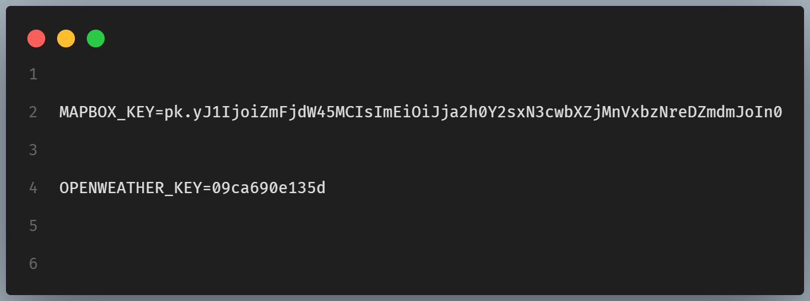
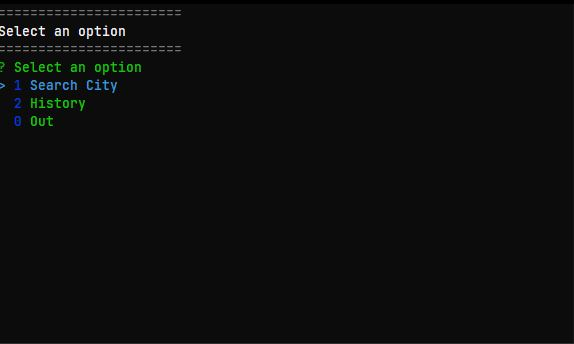
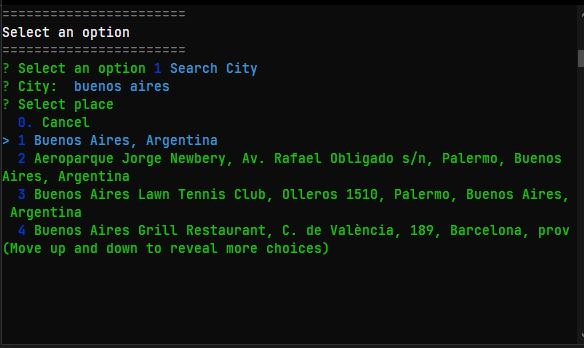
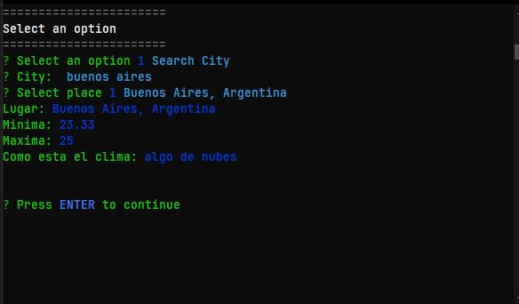

# TasksApp-CLI-Application

-   Menu buided whit [inquirer] package

## Apis

-   [MapBox]
-   [OpenWeather]

#### `You need .env file whit your api keys`

-   ### `npm install`

-   ### `npm start`

[inquirer]: https://www.npmjs.com/package/inquirer
[mapbox]: https://www.mapbox.com/
[openweather]: https://openweathermap.org/
